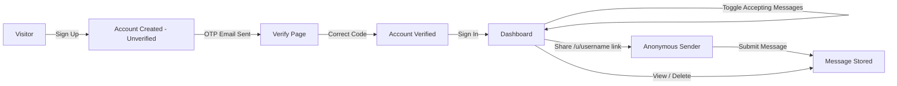
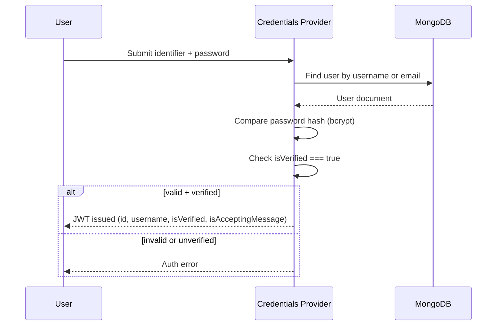
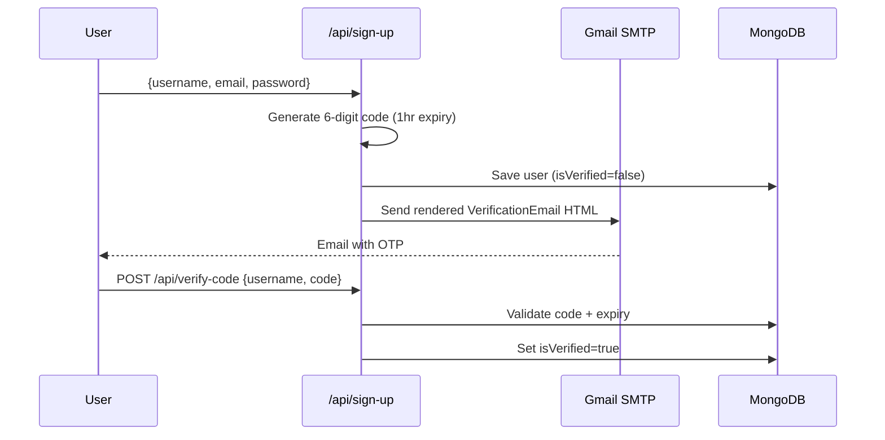
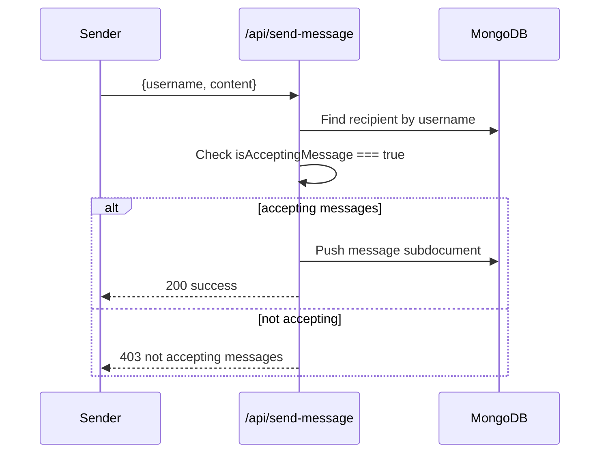
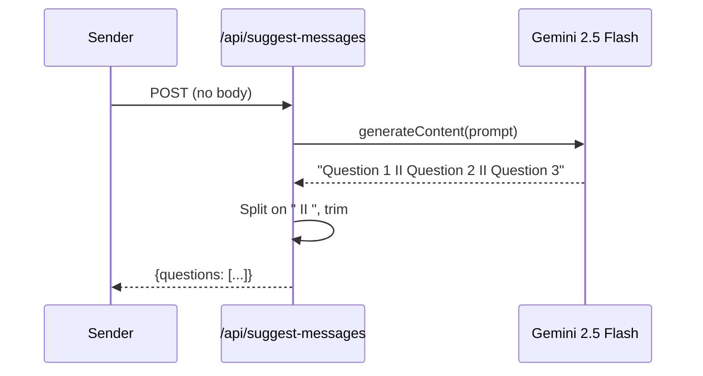

# Mystery Message

> Send and receive anonymous messages, with AI-generated conversation starters.

[](https://nextjs.org/)
[](https://www.typescriptlang.org/)
[](https://www.mongodb.com/)
[](https://next-auth.js.org/)

**Live demo:** [mysterymessage-eta.vercel.app](https://mysterymessage-eta.vercel.app/)

## Overview

Mystery Message is a full-stack messaging platform built on the App Router. Every registered user gets a unique public link that anyone can use to send them an anonymous message — no sign-in required for the sender. Recipients manage incoming messages from a private dashboard, where they can toggle whether they're accepting new messages and delete the ones they no longer want.

The project is intentionally end-to-end: custom credential-based authentication with email OTP verification, a Gemini-powered prompt suggester to help senders break writer's block, and transactional email delivered via Gmail SMTP with a React Email template.

## Features

### Authentication
- Credentials-based sign-up with username, email, and password
- Real-time username availability check (debounced) during sign-up
- Login accepts either email or username as the identifier
- Passwords hashed with `bcryptjs` before storage
- JWT session strategy via NextAuth.js, with `_id`, `username`, `isVerified`, and `isAcceptingMessage` embedded in the session/token
- Route protection via Next.js middleware (redirects unauthenticated users away from `/dashboard`, and authenticated users away from auth pages)

### Anonymous Messaging
- Public per-user message page at `/u/[username]`
- Senders are never required to authenticate
- Recipients can toggle message acceptance on/off from the dashboard
- Messages are stored as embedded subdocuments on the recipient's user record
- Dashboard supports copying the public profile link, refreshing the message list, and deleting individual messages

### AI Features
- "Suggest a message" powered by Google's Gemini (`gemini-2.5-flash`)
- Generates three open-ended, ice-breaker-style prompts on demand to help senders compose a message

### Security
- Six-digit OTP email verification required before login is permitted
- OTP codes expire one hour after generation
- Unverified accounts are blocked at the credentials-authorize step
- Server-side Zod validation on all mutating API routes
- Protected API routes verify an active NextAuth session via `getServerSession`
- IP-based rate limiting on the public `/api/send-message` and `/api/suggest-messages` endpoints

### User Experience
- Techy, dark-themed design system: dot-grid + aurora backgrounds, Space Grotesk/Inter/JetBrains Mono fonts, glassmorphic cards, violet/pink accents — consistent across every page
- Responsive UI built with shadcn/ui (Radix primitives) and Tailwind CSS v4
- Toast notifications via Sonner for form feedback and async actions
- Animated message carousel and a full "how it works" section on the landing page
- React Hook Form + Zod for client-side validation with inline error states
- Per-route `loading.tsx`, `error.tsx`, and `not-found.tsx` (including a real 404 for nonexistent `/u/[username]` profiles), plus global fallbacks


## Tech Stack

**Frontend**
- Next.js 15 (App Router, React 19, React Server Components)
- Tailwind CSS v4
- shadcn/ui + Radix UI primitives
- Lucide React (icons)
- Embla Carousel
- React Hook Form + Zod

**Backend**
- Next.js Route Handlers (`src/app/api/**`)
- Mongoose 8 (MongoDB ODM)
- bcryptjs (password hashing)

**Database**
- MongoDB (Atlas or self-hosted)

**Authentication**
- NextAuth.js v4 (Credentials provider, JWT session strategy)

**AI**
- Google Generative AI SDK (`@google/generative-ai`) — Gemini 2.5 Flash

**Email**
- Gmail SMTP via `nodemailer` (transactional email delivery, free, no domain required)
- React Email (`@react-email/components` + `@react-email/render`) for the verification template

## Project Architecture

### User Flow



### Authentication Flow



### Email Verification Flow



### Anonymous Messaging Flow



### AI Suggestion Flow



## Folder Structure

```
mysterymessage/
├── emails/
│   └── verificationEmail.tsx        # React Email OTP template
├── src/
│   ├── app/
│   │   ├── (app)/
│   │   │   ├── layout.tsx           # Navbar + content shell
│   │   │   ├── page.tsx             # Landing page (hero, how-it-works, features)
│   │   │   ├── dashboard/
│   │   │   │   ├── page.tsx         # Authenticated message dashboard
│   │   │   │   ├── loading.tsx
│   │   │   │   └── error.tsx
│   │   ├── (auth)/
│   │   │   ├── sign-in/page.tsx
│   │   │   ├── sign-up/page.tsx
│   │   │   └── verify/[username]/page.tsx
│   │   ├── u/[username]/
│   │   │   ├── page.tsx             # Public anonymous message page (server component)
│   │   │   ├── loading.tsx
│   │   │   ├── error.tsx
│   │   │   └── not-found.tsx
│   │   ├── api/
│   │   │   ├── auth/[...nextauth]/  # NextAuth handler + options
│   │   │   ├── sign-up/route.ts
│   │   │   ├── verify-code/route.ts
│   │   │   ├── check-username-unique/route.ts
│   │   │   ├── send-message/route.ts        # rate limited
│   │   │   ├── suggest-messages/route.ts    # rate limited
│   │   │   ├── get-messages/route.ts
│   │   │   ├── accept-messages/route.ts
│   │   │   └── delete-message/[messageid]/route.ts
│   │   ├── layout.tsx                # Root layout, fonts, providers
│   │   ├── globals.css
│   │   ├── icon.svg                  # Favicon
│   │   ├── loading.tsx / error.tsx / not-found.tsx / global-error.tsx
│   ├── components/
│   │   ├── MessageCard.tsx
│   │   ├── Navbar.tsx
│   │   ├── ProfileComposer.tsx       # Client UI for /u/[username]
│   │   └── ui/                       # shadcn/ui primitives + page-aura, mono-badge,
│   │                                 # auth-shell, status-shell (shared design system)
│   ├── context/
│   │   └── AuthProvider.tsx          # SessionProvider wrapper
│   ├── helpers/
│   │   └── sendVerificationEmail.ts
│   ├── lib/
│   │   ├── dbConnect.ts
│   │   ├── mailer.ts
│   │   ├── rateLimit.ts              # In-memory IP rate limiter
│   │   └── utils.ts
│   ├── model/
│   │   └── User.ts                   # User + Message Mongoose schemas
│   ├── schemas/                      # Zod validation schemas
│   ├── types/
│   │   ├── ApiResponse.ts
│   │   └── next-auth.d.ts            # NextAuth type augmentation
│   └── middleware.ts                 # Route protection
└── public/
```

## Environment Variables

Create a `.env.local` file in the project root with the following (see `.env.example` for a ready-to-copy template):

| Variable | Description |
| --- | --- |
| `MONGODB_URI` | MongoDB connection string (Atlas or local instance) |
| `NEXTAUTH_SECRET` | Secret used by NextAuth to sign/encrypt JWTs. Generate with `npx auth secret` |
| `NEXTAUTH_URL` | Your app's origin (`http://localhost:3000` locally, your deployed URL in production) |
| `GEMINI_API_KEY` | API key for Google's Generative AI (Gemini) used in `/api/suggest-messages` |
| `GMAIL_USER` | The Gmail address verification emails are sent from |
| `GMAIL_APP_PASSWORD` | A Gmail [App Password](https://myaccount.google.com/apppasswords) (requires 2-Step Verification enabled) — not your regular Gmail password |

```bash
# .env.local
MONGODB_URI=mongodb+srv://<user>:<password>@<cluster>/mysterymessage
NEXTAUTH_SECRET=your-random-secret
NEXTAUTH_URL=http://localhost:3000
GEMINI_API_KEY=your-gemini-api-key
GMAIL_USER=your-gmail-address@gmail.com
GMAIL_APP_PASSWORD=your-16-character-app-password
```

## Local Development

**Prerequisites:** Node.js 18+, a MongoDB connection string, a Gemini API key, and a Gmail account with an App Password.

```bash
# 1. Clone the repository
git clone https://github.com/<your-username>/mysterymessage.git
cd mysterymessage

# 2. Install dependencies
npm install

# 3. Configure environment variables
cp .env.example .env.local   # then fill in the values above

# 4. Run the development server
npm run dev
```

The app will be available at `http://localhost:3000`.

Other scripts:

```bash
npm run build   # production build
npm start       # run production build
npm run lint    # run ESLint
```

## Production Deployment

### Vercel
1. Push the repository to GitHub.
2. Import the project into [Vercel](https://vercel.com/new).
3. Vercel auto-detects Next.js — no custom build configuration is required.

This project is deployed at [mysterymessage-eta.vercel.app](https://mysterymessage-eta.vercel.app/).

### Environment Variables
Add `MONGODB_URI`, `NEXTAUTH_SECRET`, `NEXTAUTH_URL`, `GEMINI_API_KEY`, `GMAIL_USER`, and `GMAIL_APP_PASSWORD` to your Vercel project settings (Production, Preview, and Development scopes as needed).
- `NEXTAUTH_URL` — set to your deployed origin (e.g. `https://your-app.vercel.app`). NextAuth logs a warning and can misbehave on auth callbacks without it.
- `NEXTAUTH_SECRET` — generate a real random value (`npx auth secret`), don't reuse a guessable string.

### MongoDB Atlas
1. Create a free cluster at [MongoDB Atlas](https://www.mongodb.com/cloud/atlas).
2. Whitelist `0.0.0.0/0` (or Vercel's IP ranges) under Network Access.
3. Create a database user and copy the connection string into `MONGODB_URI`.

### Gmail SMTP
Verification emails are sent via Gmail SMTP (`nodemailer`) instead of a third-party email API — free, works for any recipient immediately, no domain or DNS setup required.
1. Enable 2-Step Verification on the Google account you want to send from.
2. Generate an [App Password](https://myaccount.google.com/apppasswords) (16 characters, no spaces).
3. Set `GMAIL_USER` to that Gmail address and `GMAIL_APP_PASSWORD` to the generated password — **not** your regular Gmail login password.
4. Free Gmail accounts cap outbound mail at roughly 500/day, far above what this app needs at portfolio scale. Deliverability is solid but not guaranteed to bypass spam filters the way a verified custom domain would.

### Gemini
1. Create an API key in [Google AI Studio](https://aistudio.google.com/).
2. Set `GEMINI_API_KEY`. No additional configuration is required for `gemini-2.5-flash`.

## API Routes

| Route | Method | Auth | Purpose |
| --- | --- | --- | --- |
| `/api/auth/[...nextauth]` | GET, POST | — | NextAuth.js sign-in/sign-out/session handler |
| `/api/sign-up` | POST | No | Creates a new user, generates an OTP, sends the verification email |
| `/api/verify-code` | POST | No | Validates the OTP for a username and marks the account verified |
| `/api/check-username-unique` | GET | No | Checks whether a username is available (query param `username`) |
| `/api/send-message` | POST | No | Submits an anonymous message to a recipient by username |
| `/api/suggest-messages` | POST | No | Returns three AI-generated message prompts from Gemini |
| `/api/get-messages` | GET | **Yes** | Returns all messages for the signed-in user (newest first) |
| `/api/accept-messages` | GET | **Yes** | Returns the current user's `isAcceptingMessage` status |
| `/api/accept-messages` | POST | **Yes** | Updates the current user's `isAcceptingMessage` status |
| `/api/delete-message/[messageid]` | DELETE | **Yes** | Deletes a single message belonging to the signed-in user |

Authenticated routes verify the session with `getServerSession(authOptions)` and operate only on the requesting user's own data.

## Key Technical Decisions

- **Embedded messages over a separate collection** — Messages are stored as subdocuments on the `User` model rather than in their own collection. This keeps reads for a user's inbox to a single document fetch, at the cost of unbounded document growth for high-volume accounts.
- **JWT sessions instead of database sessions** — NextAuth is configured with the JWT strategy so that session lookups don't require a database round trip on every request; user state (`isVerified`, `isAcceptingMessage`) is embedded directly in the token.
- **Username or email as login identifier** — The Credentials provider resolves a single `identifier` field against both `username` and `email`, simplifying the sign-in form to one input instead of two.
- **OTP-gated activation** — Accounts exist in the database immediately after sign-up but are blocked at the authorization step until `isVerified` is `true`, preventing unverified or fake emails from accessing the dashboard.
- **Senders never authenticate** — The public `/u/[username]` and `/api/send-message` routes are intentionally open, since the core product is anonymous messaging.

## Future Improvements

- Move messages to a dedicated collection with pagination once inboxes grow large
- Support OAuth providers (Google/GitHub) alongside credentials login
- Add automated tests (unit tests for schemas/helpers, integration tests for API routes)
- Move the in-memory rate limiter to a shared store (e.g. Upstash Redis) if deployed across multiple instances
- Verify a custom sending domain (Resend, SES, etc.) for stronger email deliverability than Gmail SMTP at higher volume

## Contributing

Contributions are welcome.

1. Fork the repository and create a feature branch: `git checkout -b feat/your-feature`
2. Make your changes, following the existing TypeScript/ESLint conventions
3. Run `npm run lint` before committing
4. Commit with a clear, descriptive message
5. Open a pull request describing the change and its motivation

Please open an issue first for significant changes so the approach can be discussed before implementation.
